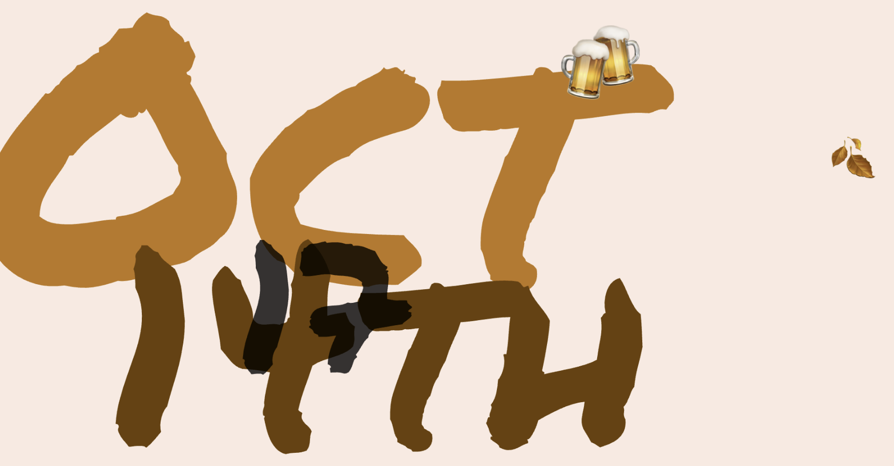
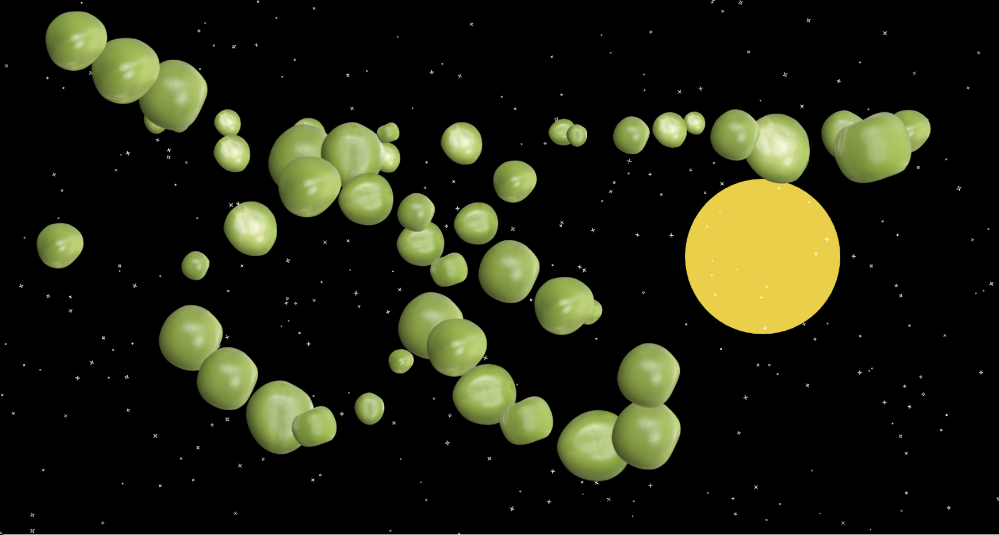

## HW04A
For the first assignment, I tried to make the page show the month, day and hour.

The emoji shows what to do consist with the time, for example. the beer image shows for the 5-7pm.
And the season image will change with the month, it will appear with the place the mouse click.

# HW04B
For the latter, I tried this one: 
"Leave a pea wherever you go."

I found some pea png files in the internet, when mouse move in the canvas, the pea will appears, and leave the track.
The background is because I think the night is quite romantic :).
